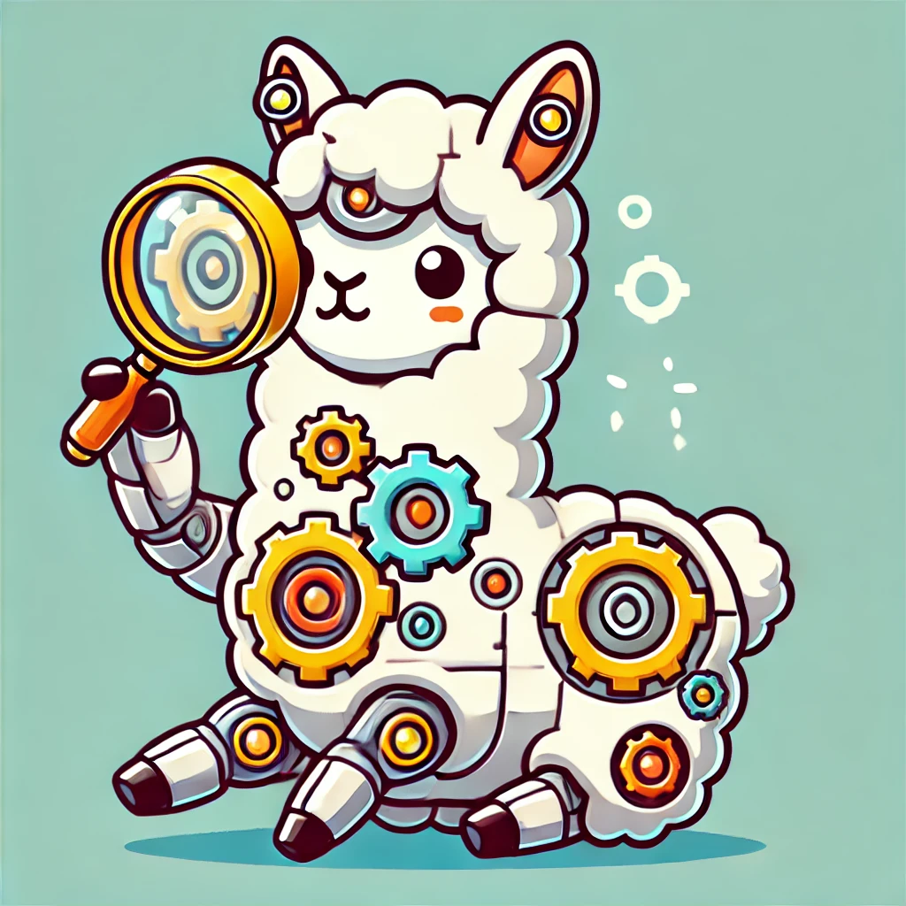
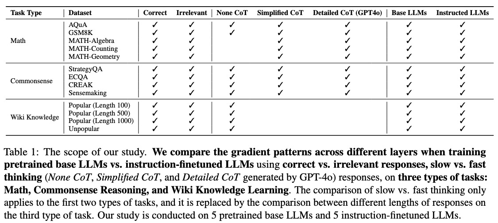

# What Happened in LLMs Layers when Trained for Fast vs. Slow Thinking: A Gradient Perspective

[What Happened in LLMs Layers when Trained for Fast vs. Slow Thinking: A Gradient Perspective](https://arxiv.org/abs/2410.23743) <br>
Chinese Version: [[知乎]](https://zhuanlan.zhihu.com/p/5721256577)

This is the repo for the Layer_Gradient project, in which we try to understand the layer-wise gradient behaviors when LLMs are finetuned on Fast vs. Slow Thinking. 

<p align="center" width="40%">
<a ></a>
</p>

The repo contains:

- The code for Calculating Gradient Statistics.
- The code for Visualizing Gradient Statistics.
- The Gradient Statistics within our experimental scope.

(Feel free to email Ming ([Email](minglii@umd.edu)) for any questions or feedback.)

## News
- [2025/02] All the **Gradient Statistics** within our experimental scope have been released in (Layer_Gradient_hf)[https://huggingface.co/datasets/MingLiiii/Layer_Gradient], hoping to contribute to the community. 
- [2024/10] We released the Layer_Gradient paper!

## Contents
- [Overview](#overview)
- [Highlights](#highlights)
- [Install](#install)
- [Run Code](#run-code)
- [Data](#data)
- [ToDo](#todo)
- [Citation](#citation)
- [Our Related Works](#our-related-works)

## Overview

What makes a difference in the post-training of LLMs? We investigate the training patterns of different layers in large language models (LLMs), through the lens of gradient, when training with different responses and initial models. We are specifically interested in how fast vs. slow thinking affects the layer-wise gradients, given the recent popularity of training LLMs on reasoning paths such as chain-of-thoughts (CoT) and process rewards. In our study, fast thinking without CoT leads to larger gradients and larger differences of gradients across layers than slow thinking (Detailed CoT), indicating the learning stability brought by the latter. Moreover, pre-trained LLMs are less affected by the instability of fast thinking than instruction-tuned LLMs. Additionally, we study whether the gradient patterns can reflect the correctness of responses when training different LLMs using slow vs. fast thinking paths. The results show that the gradients of slow thinking can distinguish correct and irrelevant reasoning paths. As a comparison, we conduct similar gradient analyses on non-reasoning knowledge learning tasks, on which, however, trivially increasing the response length does not lead to similar behaviors of slow thinking. Our study strengthens fundamental understandings of LLM training and sheds novel insights on its efficiency and stability, which pave the way towards building a generalizable System-2 agent.

## Highlights

**Our Key Findings:**
* Training LLMs for slow thinking (Detailed CoT) leads to similar gradient norms of different layers, while fast thinking (Simplified/None CoT) results in larger gradients (fast forgetting) of earlier layers and drastic differences across layers.
* The gradient of slow thinking (Detailed CoT) helps distinguish correct responses from irrelevant responses. Without CoT, the gradient patterns of the two types of responses are similar.
* The instruction-finetuned LLMs do not show superior capability over pre-trained base LLMs in identifying incorrect reasoning paths.
* The above observations on reasoning tasks (math and commonsense) cannot be extended to knowledge learning tasks, where simply increasing response length does not show similar gradient patterns as slow thinking.

## Install

Install the dependencies with `pip install -r requirements.txt`

Note: The calculation of IFD scores only needs the ```transformers``` package, thus if you are using a different code base with ```transformers``` installed, you can directly run the code and manually install the missing packages. 

## Run Code

### Calculating Gradient Statistics

1. For pre-trained LLMs
```
python code_gradient/get_gradient_values.py \
    --data_path data/cot_500/aqua_train_no_cot.json \
    --save_path grads_exp/cot_500/llama3_8b/grads_aqua_train_no_cot.jsonl \
    --model_name_or_path meta-llama/Meta-Llama-3.1-8B \
    --max_length 1024 
```

2. For instructed LLMs
```
python code_gradient/get_gradient_values.py \
    --data_path data/cot_500/aqua_train_no_cot.json \
    --save_path grads_exp/cot_500/llama3_8b_it_new/grads_aqua_train_no_cot.jsonl \
    --model_name_or_path meta-llama/Llama-3.1-8B-Instruct  \
    --max_length 1024 \
    --run_instruct_version
```
Note: In this script, we use the AQuA data without CoT as an example. <br>
**Note: The calculation of gradients is extremely time and compute-consuming, it takes much more time than directly finetuning these data. We will release all the Gradient Statistics within our experimental scopes.** 

### Visualizing Gradient Statistics

1. For reasoning tasks
```
python code_vis/get_table_figure_for_reasoning.py \
    --model_name llama3_8b \
    --task_name cot_500 \
    --data_name grads_aqua_train \
    --include_ratio 0
```
2. For math tasks
```
python code_vis/get_table_figure_for_math.py \
    --model_name llama3_8b \
    --task_name lighteval_math \
    --data_name grads_algebra \
    --include_ratio 0
```
3. For wiki tasks
```
python code_vis/get_table_figure_for_wiki.py \
    --model_name llama3_8b \
    --task_name wiki_popularity \
    --include_ratio 0
```

## Data

The datasets we use include three categories: **Math**, **Commonsense Reasoning**, and **Wiki Knowledge**. The Math and Commonsense Reasoning datasets are utilized to explore the gradients when LLMs are fine-tuned to learn the reasoning process (slow or fast thinking) and the Wiki Knowledge datasets are utilized to explore the gradients when LLMs are fine-tuned to learn pure knowledge. Due to the slow process of calculating gradients, we randomly sample 500 data instances for each task for our extensive experiments. The scope of our study:

<p align="center" width="100%">
<a ></a>
</p>

`data/cot_500` contains some of the math datasets and commonsense reasoning datasets that can be transformed into None CoT, Simplified CoT, and Detailed CoT settings. <br> 
`data/cot_500_wrong_answer_shuffle` contains the same instruction data above, while the corresponding responses are incorrect. <br>

`data/lighteval_math` contains the math datasets that can be transformed into Simplified CoT, and Detailed CoT settings. <br> 
`data/lighteval_math_wrong_answer_shuffle` contains the same instruction data above, while the corresponding responses are incorrect. <br>

`data/wiki_popularity` contains the wiki knowledge data we collected, which are categorized into popular and unpopular, and the popular ones are further categorized into different response lengths. <br>
`data/wiki_popularity_wrong_answer_shuffle` contains the same instruction data above, while the corresponding responses are incorrect. <br>

## ToDo
- [x] Release paper and codes. 
- [x] Release the gradient statistics.

## Citation

Please consider citing our papers if you think our code or data are useful. Thank you! <br>
```
@misc{li2024happenedllmslayerstrained,
      title={What Happened in LLMs Layers when Trained for Fast vs. Slow Thinking: A Gradient Perspective}, 
      author={Ming Li and Yanhong Li and Tianyi Zhou},
      year={2024},
      eprint={2410.23743},
      archivePrefix={arXiv},
      primaryClass={cs.CL},
      url={https://arxiv.org/abs/2410.23743}, 
}
```

## Our Related Works

If you are interested in **Data Selection** for Instruction Tuning, please see [Cherry_LLM](https://github.com/MingLiiii/Cherry_LLM) and [Superfiltering](https://github.com/tianyi-lab/Superfiltering). <br>
If you are interested in **human/LLM-free Data Augmentation** for Instruction Tuning, please see [Mosaic-IT](https://github.com/tianyi-lab/Mosaic-IT) and [RuleR](https://github.com/MingLiiii/RuleR). <br>
If you are interested in **Data Improvement** for Instruction Tuning, please see [Reflection_Tuning](https://github.com/tianyi-lab/Reflection_Tuning). <br>
If you are interested in **Knowledge Distillation** in the LLM era, please see this [Survey](https://github.com/Tebmer/Awesome-Knowledge-Distillation-of-LLMs). <br>


